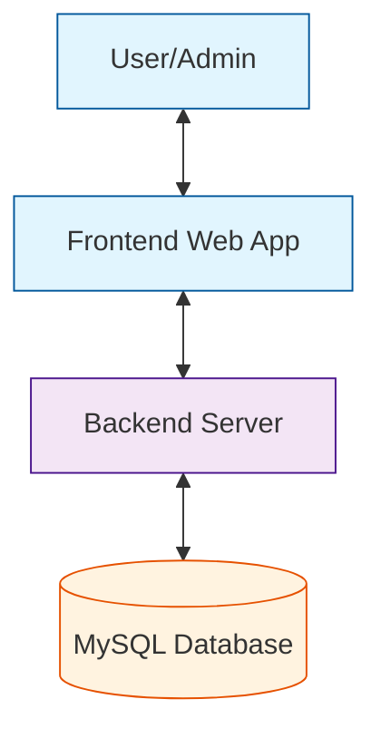
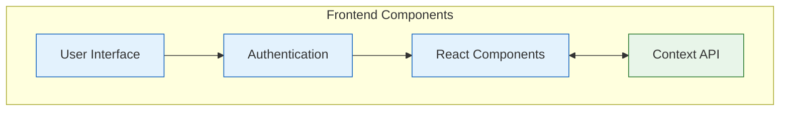
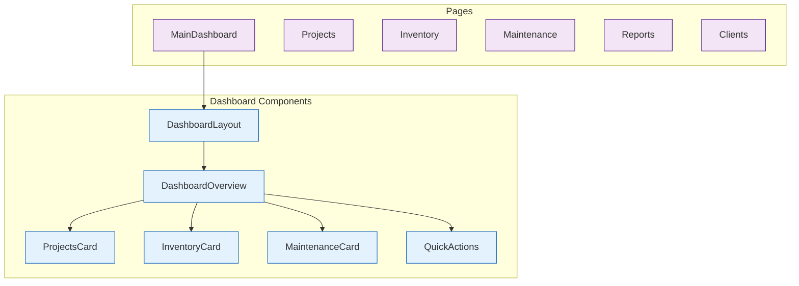
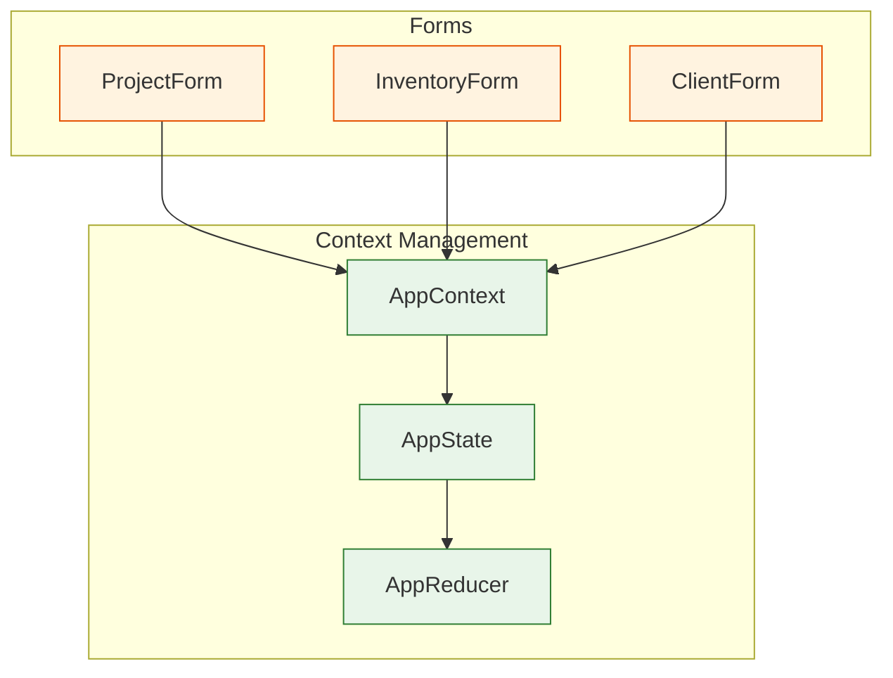
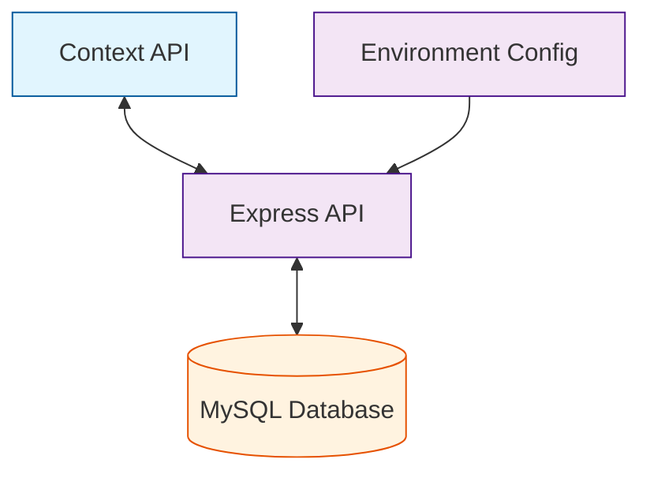

# Teltec System Data Flow Diagram

## System Overview


## Frontend Architecture


## Page Structure


## State Management


## Backend Integration

```


1. System Overview Layer
The highest level shows the main system components:

User/Admin: End users who interact with the system
Frontend Web App: React-based web interface
Backend Server: Express.js server handling API requests
MySQL Database: Data persistence layer
2. Frontend Architecture Layer
Shows the core frontend components:

User Interface (UI): Visual components and layouts
Authentication: Handles user login/access control
React Components: Reusable UI building blocks
Context API: Global state management system
3. Page Structure Layer
Details the main application pages and their components:

Pages
MainDashboard: Primary landing page
Projects: Project management section
Inventory: Equipment tracking
Maintenance: System maintenance features
Reports: Data analysis views
Clients: Client management section
Dashboard Components
DashboardLayout: Main layout wrapper
DashboardOverview: Summary view
ProjectsCard: Project status display
InventoryCard: Inventory status
MaintenanceCard: Maintenance tasks
QuickActions: Common user actions
4. State Management Layer
Shows how data flows through the application:

Context Management
AppContext: Global state container
AppState: Current application state
AppReducer: State update logic
Forms
ProjectForm: Project data entry
InventoryForm: Inventory management
ClientForm: Client information
5. Backend Integration Layer
Demonstrates server-side connections:

Context API: Frontend state management
Express API: Backend request handling
Environment Config: System configuration
MySQL Database: Data storage
Color Coding
🔵 Frontend (light blue): User-facing components
🟣 Backend (purple): Server-side logic
🟡 Database (orange): Data storage
🟢 Context (green): State management
🔷 Components (blue): UI elements
Data Flow Patterns
User interactions trigger Context API actions
Context API communicates with Express backend
Backend processes requests and interacts with database
Data flows back through the same path to update UI